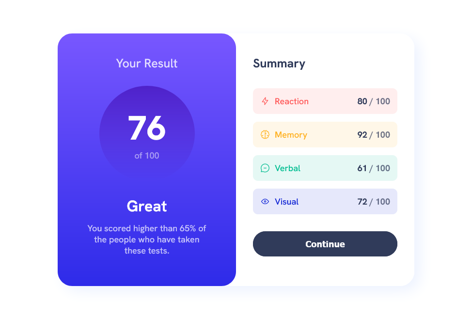

## Overview
This is my solution for front-end mentor challenge name: [Results summary component](https://www.frontendmentor.io/challenges/results-summary-component-CE_K6s0maV).
I have done it in 2 way.  flexbox and block which is the the file flexboxAndBlockElements and 2nd is complete flexbox method which is the main file index.html

### Screenshot
Mobile view\

desktop view\

# Demo
    [FireShot](https://getfireshot.com/)

### Built with
- Mobile-first workflow
- Semantic HTML5 markup
- Flexbox
- CSS custom properties

### What I learned
    I learned about Flexbox and its properties

